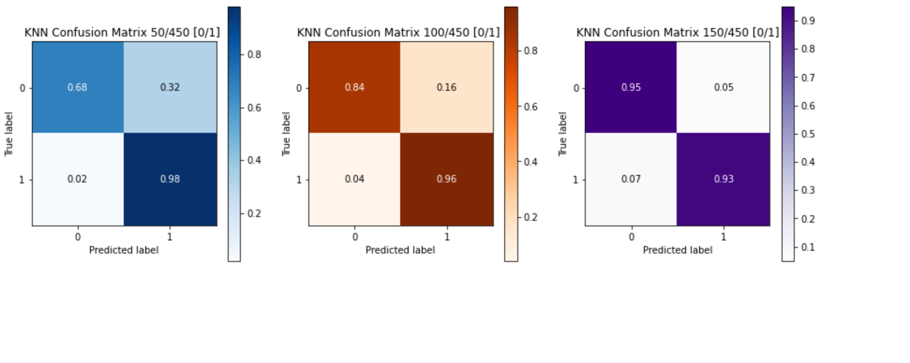

# MDST Tutorials - F23

## ML Challenge

---
Analyzing KNN classification accuracy with relation to sample class imbalance

## Setup

1. If you haven't already, fill out this [form](https://forms.gle/U9oGX52cSzTVtoNp7) and join our mailing list. This will keep you up-to-date on the club.

2. Download the files in this repo by clicking `Code` (the green button near the top) -> `Download ZIP` and unzip the files into a folder. You can of course also fork the repo if you have experience with Git.

3. Follow the general setup [guide](https://docs.google.com/document/d/17AOCdbztv6G0t5cha2_9buWi-MrCUS0vN20rbpKg-GI/edit?usp=sharing).

4. Complete the Git setup [guide](https://docs.google.com/document/d/1pq42R2xr_yoyhyzWE0ugReHgEKgwLdjrJR4mT3_CQEo/edit?usp=sharing).

For most people, this is the _hardest_ part of the tutorial! If you feel frustrated, know it is normal. Come see us at tutorials or office hours and we will help you out.

### What do I do if I cannot get the setup working in time?

If you have trouble with the general setup, you can follow the Google Colab setup [guide](https://docs.google.com/document/d/14ely7Xi_r1AFLAsMrKuHHcwqgAMnWV4QrbnK_uTJzYc/edit?usp=sharing) and use Colab to complete the tutorials.

You can also use [deepnote](https://deepnote.com/) or [hex](https://hex.tech/). For the later, you _must not_ sign up with your umich.edu email address.

If you have trouble with the Git setup, you can upload your files to Git by going to your GitHub repository and do `Add file` -> `Upload files`.

## Tutorials & Checkpoints

Get started with `tutorial0` and `checkpoint0` in the `tutorial0` folder and then move on to `tutorial1` and `checkpoint1` in the `tutorial1` folder. We recommend working through each tutorial before attempting the corresponding checkpoint.

The two challenges in the `Optional Challenges` folder are completely optional. You will find instructions about them in the submission section.

The `Data-Visualization` folder contains materials for those who want to get a head start. `pandas.ipynb` is a very brief introduction to internal Pandas data visualization tools. The `AnatomyofMatplotlib` folder contains a comprehensive tutorial for the Matplotlib library, which most beginner projects use and is foundational to other data visualization packages such as `seaborn`.

## How we are supporting you

These checkpoints are _not_ meant to be selective. Their sole purpose is to give you sufficient foundational knowledge about Python and some important packages so you can start contributing to a project.

The definition of success for us is to have everyone who begins the tutorials finish them. Thus, we will offer support in two ways:

-   Sunday Tutorials: Live tutorials will be held from 12 to 3 on 9/3 and 9/10, in-person only, at fishbowl classrooms. These are the stand-alone rooms in fishbowl in Mason Hall. Tutorials will be a combination of short presentations and Q&A.

-   Weekday Office Hours: We will be offering office hours from 7 to 9 PM on 9/5, 9/12, and 9/14. We will offer these in-person at the third floor of UGLI.

Neither tutorials nor office hours are mandatory.

We have also created a [Piazza forum](https://piazza.com/umich/fall2023/mdst101) where you can ask questions.

Join the mailing list and monitor the join [page](https://www.mdst.club/join) for updates.

## Submission

A submission form where you will also indicate your project preferences will be released via both email and our [website](mdst.club) in the upcoming weeks. The submission deadline is tentatively `11:59 PM, 9/14`. You _absolutely_ must submit the form by the deadline to work on a project this semester.

In your submission, we are looking for:

-   [**REQUIRED**] checkpoint 0 and checkpoint 1. These are assessed by completion and effort, not accuracy.
-   [**OPTIONAL**] ML Challenge and Stats Challenge. These are assessed by merit. We usually put new members on beginning projects for their very first semester but you may want to work on advanced projects right away if you are experienced with data science. You will be able to demonstrate said experience in these two challenges. You can choose to complete one or both of them.

It is strongly recommended for you to complete at least one challenge if the project you are most interested in is labelled as an advanced project. This will give you the best chance to be placed on that team.

## Contact

If you have any questions, concerns, or bug reports, don't hesitate to contact Casper at casperg@umich.edu.
